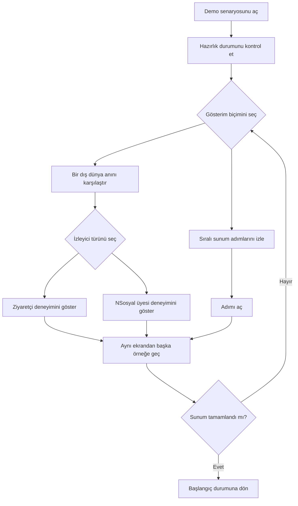
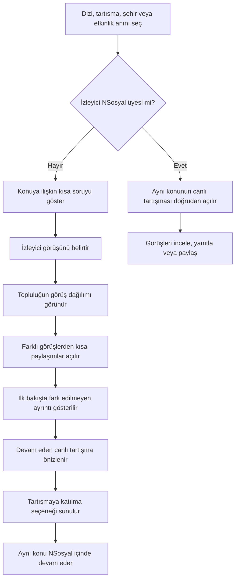
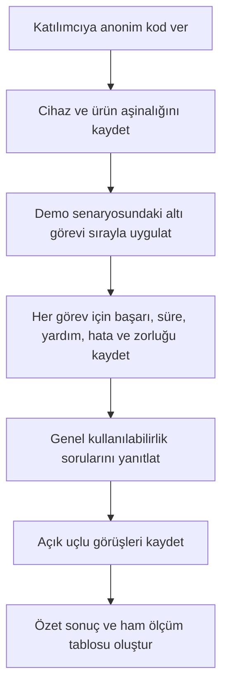

# NSosyal Demo Senaryosu: Kullanıcı Akışları, Arayüz ve Erişilebilirlik Raporu

**Tarih:** 24 Ağustos 2026

**Kapsam:** Yalnızca demo senaryosu kontrol ekranı ve bu ekrandan sunulan örnek deneyimler

## Yönetici özeti

Demo senaryosu, sunumu yapan kişinin NSosyal prototipindeki seçili deneyimleri aynı başlangıç koşullarıyla ve belirli bir sırayla gösterebilmesini sağlar. Bu rapor yalnızca aşağıdaki demo bileşenlerini değerlendirir:

- sunum başlığı ve kontrol alanı,
- hazırlık durumu ve ilerleme özeti,
- farklı yayın ve şehir anlarını temsil eden bağlam kartları,
- ziyaretçi ve NSosyal üyesi gösterim seçenekleri,
- dokuz adımlı sunum listesi,
- başlangıç durumuna dönme adımı,
- demo senaryosuna bağlı kullanılabilirlik testi.

Rapor; prototipin genel sayfa yapısını, bütün ürün navigasyonunu veya geliştirme ayrıntılarını açıklamaz. Diyagramlar yalnızca sunum sırasında görülen kullanıcı davranışlarını ve bileşenler arasındaki anlaşılır geçişleri gösterir.

## 1. Demo senaryosu bileşenleri

| Bileşen | Sunumdaki görevi | Kullanıcıya sağladığı bilgi |
| --- | --- | --- |
| Sunum üst alanı | Ürün kimliğini ve sunum modunu ayırır | Kullanıcı, normal ürün deneyiminde olmadığını anlar |
| Hazırlık özeti | Tüm adımların çalışır durumda olduğunu gösterir | Sunumu yapan kişi başlamadan önce durumu kontrol eder |
| Bağlam kartları | Aynı sosyal deneyimi farklı dış dünya anlarıyla örnekler | Dizi, tartışma programı, şehir gündemi ve teknoloji etkinliği karşılaştırılabilir |
| Giriş seçenekleri | Ziyaretçi ve mevcut üye deneyimini ayırır | Aynı konuya iki farklı başlangıçtan girildiği anlaşılır |
| Sıralı adım listesi | Sunumun önerilen anlatım düzenini gösterir | Her adımın adı, amacı ve hazır olma durumu birlikte görülür |
| Adımı aç düğmesi | Seçilen örneği hazırlar ve gösterir | Sunumu yapan kişi elle veri hazırlamak zorunda kalmaz |
| Başlangıca dönme adımı | Önceki seçimlerin etkisini temizler | Yeni sunum aynı koşullarla başlatılabilir |
| Kullanılabilirlik testi girişi | Demo görevlerinin ölçümlü değerlendirmesini açar | Görev süreleri, başarı ve gözlemler düzenli kaydedilebilir |

## 2. Kullanıcı akışları

### 2.1 Sunumu yapan kişinin ana akışı

Akış, sunumu yapan kişiye iki serbestlik düzeyi verir: İster farklı dış dünya anlarını karşılaştırabilir, ister önerilen dokuz adımlı anlatımı sırayla izleyebilir. Her örnek kendi gerekli başlangıç durumunu hazırladığı için önceki gösterimden kalan seçimlerin anlatımı bozma riski azalır.

### 2.2 Bağlamsal sosyal deneyim gösterimi

Buradaki temel karar, ziyaretçiye üyelik çağrısından önce sosyal değeri göstermektir. Sonraki adım, kullanıcıya görünen gerçek eylem olan “Tartışmaya katıl” ifadesiyle anlatılır.

### 2.3 Dokuz adımlı sunum anlatısı

```mermaid
flowchart LR
    A["1 · Ziyaretçi olarak konuyu keşfet"] --> B["2 · Aynı tartışmada üye olarak devam et"]
    B --> C["3 · İlgi alanlarını seç"]
    C --> D["4 · Kişisel akışın değişimini gör"]
    D --> E["5 · Bir içeriğe ilgi geri bildirimi ver"]
    E --> F["6 · Günlük, haftalık ve gözden kaçan seçkileri incele"]
    F --> G["7 · Daha rahat görünümü seç"]
    G --> H["8 · Bir süre sonra geri dönüş özetini gör"]
    H --> I["9 · Sunumu başlangıç durumuna getir"]
```

Adımlar teknik ekran adlarıyla değil, sunumda anlatılan kullanıcı kazanımlarıyla adlandırılır. Böylece raporu okuyan kişi uygulamanın iç yapısını bilmeden akışın amacını anlayabilir.

### 2.4 Kullanılabilirlik değerlendirmesi

## 3. Arayüz tasarım kararları

| Karar | Gerekçe | Demo senaryosundaki uygulama | Beklenen yarar |
| --- | --- | --- | --- |
| Sunum aracını ürün ekranından ayırmak | Sunumu yapan kişinin kontrolleri son kullanıcı arayüzüyle karışmamalı | Ayrı üst alan, sunum modu açıklaması ve çıkış kontrolü | Gösterim sırasında yanlış ürün algısı azalır |
| Tek, sınırlı okuma sütunu | Geniş ekranda içeriğin dağılmasını önlemek | İçerik alanı en fazla 880 piksel genişliğinde ortalanır | Adımlar ve bağlam kartları birlikte taranabilir |
| Bağlamları kart düzeninde karşılaştırmak | Aynı yapının farklı anlara uyarlanabildiğini hızlı göstermek | Her kartta kaynak türü, kaynak adı, kısa soru ve iki giriş seçeneği bulunur | Kavram tekrar anlatılmadan çeşitlilik anlaşılır |
| Dokuz adımı numaralı listelemek | Sunum sırasını görünür ve tekrarlanabilir yapmak | Numara, başlık, açıklama, durum ve açma eylemi aynı satırda | Sunumu yapan kişi nerede kaldığını kolay bulur |
| Hazır olma durumunu metinle göstermek | Yalnız renge dayalı durum göstergesi kullanmamak | Yeşil tonuna ek olarak “Hazır” ve tamamlanan adım sayısı yazılır | Renk algısı farklılıklarında anlam korunur |
| Her adımda başlangıç koşulunu hazırlamak | Önceki gösterimlerin yeni adımı etkilemesini önlemek | Adım açıldığında ilgili örnek durum otomatik hazırlanır | Sunum daha öngörülebilir olur |
| Küçük ekranda tek sütuna geçmek | Telefon sunumlarında kart ve düğme sıkışmasını önlemek | Bağlam kartları tek sütuna, adım düğmeleri başlığın altına geçer | Okunabilirlik ve dokunma rahatlığı korunur |
| Ana eylemleri açık fiillerle yazmak | Teknik terimler sunum anlatısını zorlaştırır | “Ziyaretçi”, “NSosyal üyesi”, “Adımı aç” ve “Başlangıç durumuna dön” | Eylemin sonucu önceden anlaşılır |

## 4. Erişilebilirlik yaklaşımı

### 4.1 Uygulanan yaklaşım

| Alan | Mevcut yaklaşım | Demo senaryosundaki örnek |
| --- | --- | --- |
| Anlamsal yapı | Üst alan, ana içerik, bölümler ve sıralı liste kullanılır | Dokuz adım gerçek bir sıralı liste olarak sunulur |
| Başlık ilişkileri | Bölümler görünür başlıklarla ilişkilendirilir | Tanıtım, hazırlık özeti ve bağlam örneklerinin ayrı başlıkları vardır |
| Durum duyuruları | Değişen durumlar yardımcı teknolojiye bildirilir | İlerleme özeti durum alanı; sıfırlama sonucu canlı duyurudur |
| Yalnız renge dayanmama | Renk, metin ve simge birlikte kullanılır | “Hazır” etiketi ve tamamlanan adım sayısı yazıyla verilir |
| Dekoratif simgeler | Anlam taşımayan simgeler okuma sırasından çıkarılır | Kart ve durum simgeleri gizli dekoratif öğelerdir |
| Dokunma alanı | Temel düğmeler en az 44 piksel yüksekliğe yaklaşır veya ulaşır | Üst alan ve adım açma kontrolleri telefonda rahat dokunulur |
| Duyarlı yerleşim | İçerik 600 piksel altında yeniden sıralanır | İki sütunlu bağlam kartları tek sütuna dönüşür |
| Tema uyumu | Ana yüzey ve metinler ortak renk değişkenlerini kullanır | Açık ve karanlık görünümde temel sayfa yapısı korunur |

### 4.2 Kontrast kontrolü

Demo kontrol ekranındaki temel renk çiftlerinin hesaplanan kontrastları:

| Kullanım | Renk çifti | Kontrast | Değerlendirme |
| --- | --- | ---: | --- |
| Ana metin | Koyu metin / beyaz yüzey | 17,96:1 | AA ve AAA düzeylerini karşılar |
| İkincil metin | Gri metin / beyaz yüzey | 5,80:1 | Normal metinde AA düzeyini karşılar |
| Hazır durumu | Koyu yeşil / açık yeşil yüzey | 6,22–6,37:1 | Normal metinde AA düzeyini karşılar |
| Küçük mavi metin | Marka mavisi / açık sayfa yüzeyi | 3,38:1 | Normal boyuttaki küçük metin için yetersiz |
| Beyaz düğme metni | Beyaz / marka mavisi | 3,59:1 | Küçük normal metin için yetersiz olabilir |

Bu ölçüm, demo ekranında ana ve ikincil metinlerin güçlü olduğunu; küçük marka rengi metinlerin ve bazı mavi düğme kullanımlarının yeniden ayarlanması gerektiğini gösterir.

### 4.3 Erişilebilirlik bulguları

1. **Yüksek — Küçük marka rengi metinler:** Açık yüzey üzerindeki marka mavisi küçük metinlerde yeterli kontrast sağlamıyor. Daha koyu bir metin tonu veya daha büyük ve kalın yazı kullanılmalı.
2. **Yüksek — Mobil üst alan düğme adları:** Küçük ekranda düğmelerin görünür yazıları gizleniyor. Simgeli düğmelere açık erişilebilir ad eklenmeli ve ekran okuyucuyla doğrulanmalı.
3. **Orta — Tekrarlanan bağlam düğmeleri:** Her kartta aynı “Ziyaretçi” ve “NSosyal üyesi” adları bulunuyor. Erişilebilir ad, ilgili bağlamı da söylemelidir; örneğin “Dizi anını ziyaretçi olarak aç”.
4. **Orta — Seçili adım bilgisi:** Seçili adım yalnız arka plan rengiyle öne çıkıyor. Seçim durumu yardımcı teknolojiye ayrıca bildirilmelidir.
5. **Orta — Karanlık görünümde durum kartları:** Hazır olma kartındaki sabit açık yeşil yüzey, karanlık görünümde görsel bütünlüğü bozabilir. Tema değişkenleriyle yönetilmelidir.
6. **Doğrulama açığı:** Tam klavye turu, ekran okuyucu, yüksek yakınlaştırma ve otomatik erişilebilirlik taraması henüz tamamlanmadı. Bu kontroller yapılmadan tam uygunluk iddia edilmemelidir.

## 5. Demo senaryosu kullanılabilirlik testi sonucu

### 5.1 Yöntem ve sınır

24 Ağustos 2026 tarihinde demo senaryosundaki altı görev, 360 × 800 piksel telefon görünümünde tek kişilik iç uzman yürüyüşüyle uygulandı. Değerlendirici kaynak yapıya ve ürün amacına aşinaydı. Bu nedenle sonuçlar:

- test aracının ve demo adımlarının çalıştığını doğrular,
- sonraki katılımcı testine başlangıç ölçümü sağlar,
- bağımsız kullanıcı araştırması veya genellenebilir kullanılabilirlik kanıtı sayılmaz.

### 5.2 Görev sonuçları

| Demo görevi | Sonuç | Süre | Yardım | Hata | Zorluk |
| --- | --- | ---: | ---: | ---: | ---: |
| Konuşmanın katmanlarını keşfet | Başarılı | 13 sn | 0 | 0 | 1/5 |
| Aynı konuşmada devam et | Başarılı | 12 sn | 0 | 0 | 1/5 |
| Üye olarak canlı tartışmaya gir | Başarılı | 9 sn | 0 | 0 | 1/5 |
| Akış tercihine geri bildirim ver | Başarılı | 12 sn | 0 | 0 | 2/5 |
| Gözden kaçan seçkiyi bul | Başarılı | 4 sn | 0 | 0 | 1/5 |
| Görünümü kendine göre ayarla | Başarılı | 14 sn | 0 | 0 | 2/5 |

Toplu sonuçlar:

- tam görev başarısı: **6/6 — %100**,
- toplam görev süresi: **64 saniye**,
- ortalama görev süresi: **10,7 saniye**,
- toplam yardım ve hata: **0**,
- ortalama algılanan zorluk: **1,3/5**,
- Sistem Kullanılabilirlik Ölçeği sonucu: **90/100**,
- ürüne özel dört ifadenin ortalaması: **4,75/5**.

### 5.3 Nitel bulgular

- **En kolay bölüm:** Gözden Kaçanlar seçkisi ve içeriklerin neden gösterildiğini açıklayan etiketler.
- **En çok kararsızlık oluşturan bölüm:** Karanlık görünüm kontrolünün görünüm tercihlerinden ayrı bir menüde bulunması.
- **İyileştirme önerisi:** Tema kontrolünün görünüm tercihleriyle aynı alanda da sunulması.
- **Dikkat çekici değerlendirme:** “Bağlamdan topluluk nabzına geçiş adım adım ilerlediği için nerede olduğumu kaybetmedim.”

### 5.4 Mobil ve tema kontrolü

Demo görevlerinde kullanılan bağlamsal deneyim, kişisel akış, seçkiler, görünüm ayarları, paylaşım ve geri dönüş özeti telefon görünümünde kontrol edildi. Yatay taşma veya tarayıcı konsolunda çalışma hatası görülmedi. Açık ve karanlık görünüm ile rahat ve dengeli yerleşim seçeneklerinin değişimi gözle doğrulandı.

Klavye ile tam kullanım ve ekran okuyucu davranışı bu oturumun kapsamına alınmadı; erişilebilirlik bulguları bu nedenle uygulama incelemesi ve kontrast ölçümü düzeyindedir.

## 6. Önceliklendirilmiş öneriler

1. Demo ekranındaki küçük mavi metinlerin kontrastını artır.
2. Mobil üst alan düğmelerine görünür metinden bağımsız erişilebilir ad ekle.
3. Bağlam kartlarındaki tekrarlanan düğme adlarına bağlam adını dahil et.
4. Seçili sunum adımını yardımcı teknolojiye programatik olarak bildir.
5. Tema kontrolünü görünüm tercihlerinin yanında da göster.
6. Demo senaryosunu çoğunluğu NSosyal’i ilk kez gören 5–7 harici katılımcıyla tekrar test et.
7. En az bir yalnız klavye, bir ekran okuyucu ve yüksek yakınlaştırma oturumu ekle.

## 7. Kanıt

- Kullanılabilirlik testi protokolü: `USABILITY_TEST.md`
- İç değerlendirme görev kayıtları: `2026-08-24-internal-expert-walkthrough.csv`

## Sonuç

Demo senaryosu, bağlamsal sosyal deneyimden kişiselleştirme ve geri dönüş özetine uzanan anlatıyı tek bir sunum kontrolünde düzenliyor. İç değerlendirmede altı seçili görev tamamlandı ve akışın sunum için çalışır olduğu doğrulandı. Bununla birlikte küçük marka metinlerinin kontrastı, mobil düğme adları, tekrarlanan bağlam eylemleri ve seçili adım bildirimi düzeltilmeden erişilebilirlik açısından tamamlanmış kabul edilmemelidir. Harici katılımcılar ve yardımcı teknolojilerle yapılacak ikinci tur, demo senaryosunun gerçek kullanılabilirliğini belirleyecek asıl kanıt olacaktır.
