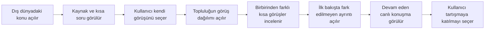
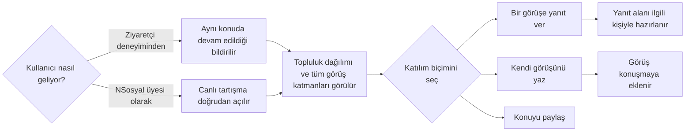
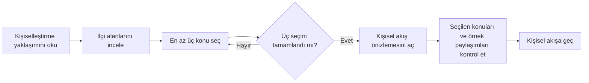
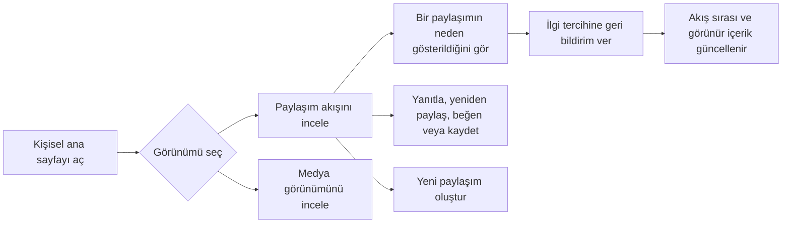
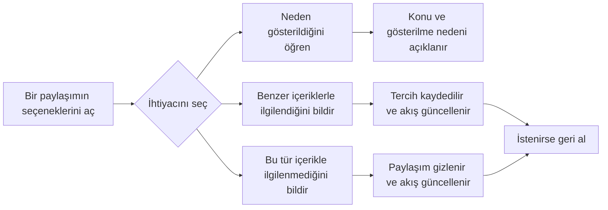
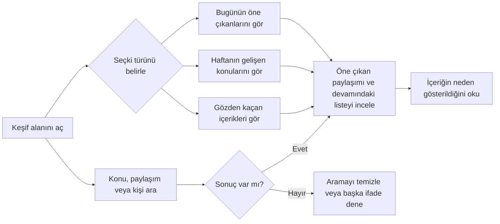
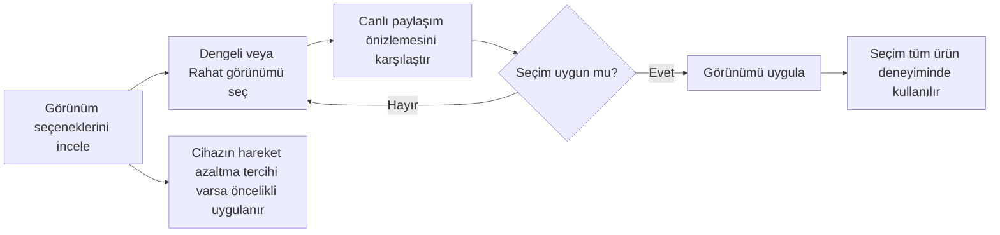
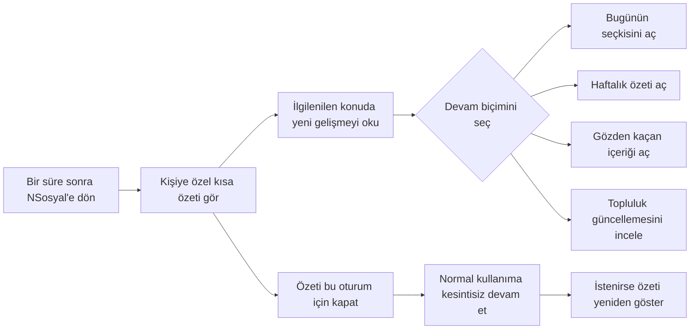

# NSosyal Ürün Özellikleri: Kullanıcı Akışları, Arayüz ve Erişilebilirlik Raporu

**Tarih:** 24 Ağustos 2026

**Kapsam:** Demo senaryosu listesinde gösterilen gerçek ürün özellikleri

## Kapsam açıklaması

Demo senaryosu yalnızca aşağıdaki ürün özelliklerini sunum sırasında açmaya yarayan bir araçtır; kendisi bu raporun konusu değildir. Her özellik kendi ekranı, kullanıcı amacı ve etkileşim düzeni üzerinden ayrı ayrı değerlendirilmiştir:

1. Bağlamsal sosyal deneyim
2. Canlı tartışma alanı
3. İlgi alanı seçimi
4. Kişiselleştirilmiş ana sayfa
5. Açık öneri kontrolü
6. Keşif seçkileri
7. Deneyim tercihi
8. Geri dönen kullanıcı özeti

Sunumu başlangıç durumuna getiren işlem bir ürün özelliği olmadığı için değerlendirmeye alınmamıştır. Diyagramlarda teknik ekran adresleri, geliştirme adları veya uygulamanın iç yapısını açığa çıkaran ifadeler kullanılmamıştır.

## Test kanıtının özelliklere dağılımı

| Ürün özelliği | Doğrudan görev sonucu var mı? | Kanıt durumu |
| --- | --- | --- |
| Bağlamsal sosyal deneyim | Var | Katmanları keşfetme görevi tamamlandı |
| Canlı tartışma alanı | Var | Ziyaretçi devamı ve üye girişi ayrı görevlerle tamamlandı |
| İlgi alanı seçimi | Yok | Görsel ve işlevsel kontrol yapıldı; katılımcı görevi uygulanmadı |
| Kişiselleştirilmiş ana sayfa | Yok | Açık öneri görevinin çalışma ortamı olarak görüldü; sıralama algısı ayrıca ölçülmedi |
| Açık öneri kontrolü | Var | İlgi geri bildirimi görevi tamamlandı |
| Keşif seçkileri | Var | Gözden kaçan içeriği bulma görevi tamamlandı |
| Deneyim tercihi | Var | Rahat görünüm ve tema değişimi görevi tamamlandı |
| Geri dönen kullanıcı özeti | Yok | Görsel ve işlevsel kontrol yapıldı; katılımcı görevi uygulanmadı |

---

## 1. Bağlamsal sosyal deneyim

Bu özellik, dış dünyadaki bir dizi, tartışma programı, şehir gündemi veya etkinlik anını NSosyal’deki topluluk görüşleriyle ilişkilendirir. Ziyaretçi, üye olmadan önce deneyimin sosyal değerini görebilir.

### Kullanıcı akışı

### Arayüz tasarım kararları

- Kaynak türü, yayın anı, ana soru ve konuşma başlıkları ilk bölümde birlikte gösterilir; kullanıcı konunun nereden geldiğini hemen anlar.
- Görüş seçenekleri büyük, tek dokunuşluk düğmeler olarak sunulur.
- Topluluk dağılımı kullanıcı kendi görüşünü belirttikten sonra açılır; çoğunluk sonucu ilk seçimi etkilemez.
- Farklı görüşler, gözden kaçan ayrıntı ve canlı konuşma aynı anda yığılmaz; sırayla açılarak bilgi yükü azaltılır.
- Yüzdeler hem sayı hem çubukla gösterilir. Sonuç oyun puanı gibi değil, topluluk görünümü gibi sunulur.
- Telefon ekranında kartlar ve eylemler tek sütunda kalır; ana içerik gereksiz genişlemez.

### Erişilebilirlik yaklaşımı

- Ana konu birinci düzey başlık, sonraki katmanlar ikinci düzey başlıklarla kurulur.
- Görüş düğmeleri seçili durumlarını yardımcı teknolojiye bildirir.
- Topluluk sonucu açıldığında değişiklik canlı olarak duyurulur.
- Yüzde bilgisi yalnız çubuk uzunluğuna veya renge bağlı değildir; sayısal değer de yazılır.
- Dekoratif simgeler okuma sırasından çıkarılır.
- Görüş düğmeleri telefonda rahat dokunulacak yüksekliktedir.
- Açılan son katılım paneli ekrana kaydırılır ancak klavye odağı bu alana taşınmaz. Klavye kullanıcıları için başlığa veya ana düğmeye odak aktarımı eklenmelidir.

### Kullanılabilirlik testi sonucu

| Görev | Sonuç | Süre | Yardım | Hata | Zorluk |
| --- | --- | ---: | ---: | ---: | ---: |
| Konuşmanın katmanlarını keşfet | Başarılı | 13 sn | 0 | 0 | 1/5 |

İç uzman, görüş verdikten sonra topluluk dağılımını hemen fark etti; farklı görüşler ve gözden kaçan ayrıntı tek birincil eylem sırasıyla bulundu. Bu sonuç tek kişilik iç değerlendirmedir ve harici katılımcı kanıtı değildir.

---

## 2. Canlı tartışma alanı

Bu özellik aynı konunun NSosyal içindeki tam tartışmasını gösterir. Ziyaretçiden gelen kişi önceki görüşünü kaybetmeden devam eder; mevcut üye ise doğrudan tartışmaya katılır.

### Kullanıcı akışı

### Arayüz tasarım kararları

- Ziyaretçi geçişinde “aynı konuşmada devam” bildirimi kullanılır; kullanıcının genel bir sayfaya atıldığı hissi önlenir.
- Kaynak özeti sıkıştırılmış biçimde korunurken topluluk dağılımı, farklı görüşler, gözden kaçan ayrıntı ve canlı konuşma açık gelir.
- Katılım alanı sayfanın sonunda ayrı bir karttır; okuma ile yazma eylemi görsel olarak ayrılır.
- Yanıt düğmesi seçilen görüşün kullanıcı adını yazı alanına getirir ve odağı alana taşır.
- Karakter sayacı ve boş metinde devre dışı kalan paylaşma düğmesi hatalı gönderimi azaltır.

### Erişilebilirlik yaklaşımı

- Süreklilik ve paylaşım sonuçları durum mesajı olarak duyurulur.
- Yazı alanının görünür yer tutucusuna ek olarak yardımcı teknoloji için açık bir etiketi vardır.
- Bir görüşe yanıt verme işlemi sonrasında klavye odağı doğrudan yazı alanına taşınır.
- Paylaşma düğmesi boş içerikte devre dışıdır; karakter sınırı görünürdür.
- “Bu görüşe yanıt ver” adı farklı görüş kartlarında tekrar eder. Ekran okuyucu kullanıcılarının hangi kişiye yanıt vereceğini ayırt etmesi için erişilebilir ada yazar adı eklenmelidir.
- Konu paylaşma düğmesinin adı anlaşılır olsa da “bağlam” yerine kullanıcıya daha doğal gelen “konu” veya “tartışma” sözcüğü tercih edilmelidir.

### Kullanılabilirlik testi sonucu

| Görev | Sonuç | Süre | Yardım | Hata | Zorluk |
| --- | --- | ---: | ---: | ---: | ---: |
| Aynı konuşmada devam et | Başarılı | 12 sn | 0 | 0 | 1/5 |
| Üye olarak canlı tartışmaya gir | Başarılı | 9 sn | 0 | 0 | 1/5 |

Ziyaretçi devamında önceki konu ve görüşün korunduğu anlaşıldı. Üye girişinde topluluk dağılımı bulundu; yanıt düğmesi kullanıcı adını yazı alanına getirip odağı doğru yere taşıdı.

---

## 3. İlgi alanı seçimi

Bu özellik kullanıcıya kişiselleştirmenin nasıl çalışacağını açıklar, en az üç konu seçtirir ve seçimlerin ilk akışa etkisini paylaşım örnekleriyle gösterir.

### Kullanıcı akışı

### Arayüz tasarım kararları

- Süreç üç kısa aşamaya bölünür: açıklama, seçim ve önizleme.
- Başlangıç metni kontrolün kullanıcıda olduğunu; hem istenen hem istenmeyen içeriklerin bildirilebileceğini açıklar.
- İlgi alanları simge, başlık ve kısa açıklama içeren büyük seçim kartlarıdır.
- Seçim sayısı ve kalan seçim sayısı anlık gösterilir. Gerekli sayı tamamlanmadan ilerleme düğmesi etkinleşmez.
- Önizleme, seçilen konuları ve bu konular nedeniyle gösterilen örnek paylaşımları birlikte sunar.
- Yükleniyor, hata ve boş durumlarının her biri ayrı, geri kazanılabilir bir ekran durumuna sahiptir.

### Erişilebilirlik yaklaşımı

- Aşama ilerlemesi açıklayıcı etiketler içeren bir gezinme bölümü olarak sunulur.
- İlgi alanı kartları seçili durumlarını yardımcı teknolojiye bildirir ve belirgin klavye odağına sahiptir.
- Seçim sayacı canlı olarak duyurulur; yalnız renk değişimine dayanmaz.
- Hata durumu uyarı olarak bildirilir, tekrar deneme ve seçimlere dönme eylemleri açık adlara sahiptir.
- Hareket azaltma tercihi seçim kartlarındaki geçişleri kapatır.
- İlerleme çubuğunda etkin aşama yalnız görsel sınıfla belirtiliyor. Güncel aşama yardımcı teknolojiye ayrıca bildirilmelidir.
- Aşama değiştiğinde odağın yeni başlığa taşınması uygulanmamıştır; klavye ve ekran okuyucu turunda doğrulanmalıdır.

### Kullanılabilirlik testi sonucu

Bu özellik için bağımsız bir görev uygulanmadı. Ekranların açıldığı, en az üç seçim kuralının çalıştığı ve önizleme durumlarının görüntülendiği işlevsel olarak kontrol edildi; kullanıcı başarısı, süre veya zorluk sonucu yoktur.

---

## 4. Kişiselleştirilmiş ana sayfa

Bu özellik seçilen ilgi alanları ve kullanıcının açık geri bildirimleriyle sıralanan paylaşım akışını, paylaşım oluşturma girişini ve medya görünümünü bir arada sunar.

### Kullanıcı akışı

### Arayüz tasarım kararları

- Ana içerik sütununun üstünde Akış ve Medya seçenekleri bulunur; iki içerik biçimi aynı yerde tutulur.
- Paylaşım oluşturma alanı akıştan önce gelir ancak besleme kartlarından görsel olarak ayrılır.
- Her paylaşımda yazar, zaman, içerik nedeni, metin, varsa medya ve etkileşimler aynı hiyerarşide sunulur.
- “Neden görüyorum?” açıklaması ve ilgi geri bildirimi paylaşımın kendi seçenekleri içinde yer alır.
- Geri bildirim sonrası kısa bir bildirim ve geri alma eylemi gösterilir.
- Telefonda yan alanlar kaldırılır, oluşturma araçlarının bir bölümü saklanır ve içerik tek sütunda kalır.

### Erişilebilirlik yaklaşımı

- Ana paylaşım akışı açıklayıcı bir bölüm adına sahiptir.
- Oluşturma araçlarının simgeleri açık erişilebilir adlarla sunulur.
- Yükleniyor, hata, boş sonuç ve geri bildirim durumları uygun biçimde duyurulur.
- Beğenme ve kaydetme düğmeleri basılı durumlarını bildirir; etkileşim sayıları erişilebilir adlara dahildir.
- Her paylaşımın seçenek düğmesi yazar adını içerdiği için tekrarlanan kontroller ayırt edilebilir.
- Akış ve Medya seçenekleri sekme olarak işaretlenmiş olsa da ok tuşu davranışı ve ilişkili içerik alanı tanımları tamamlanmamıştır. Standart klavye sekme kalıbı uygulanmalıdır.
- Telefonda görsel olarak saklanan oluşturma araçlarının erişilebilirlik ağacında nasıl davrandığı ekran okuyucuyla doğrulanmalıdır.

### Kullanılabilirlik testi sonucu

Bu sayfa açık öneri kontrolü görevinin çalışma ortamı olarak kullanıldı; ancak kişiselleştirilmiş sıralamanın fark edilmesi veya Akış–Medya geçişinin anlaşılması bağımsız görevle ölçülmedi. Bu nedenle özellik için ayrı başarı süresi veya zorluk puanı yoktur.

---

## 5. Açık öneri kontrolü

Bu özellik, kullanıcının bir paylaşımı neden gördüğünü öğrenmesini ve benzer içeriklere yönelik tercihini doğrudan bildirmesini sağlar.

### Kullanıcı akışı

### Arayüz tasarım kararları

- Kontroller paylaşım seçenekleri içinde tutulur; ana kart sürekli ek düğmelerle kalabalıklaştırılmaz.
- “Bunu neden görüyorsun?” açıklaması ayrı bir pencerede konu başlıkları ve kısa gerekçeyle verilir.
- İlgilenme ve ilgilenmeme eylemleri simetrik ve açık fiillerle yazılır.
- İlgilenmeme sonrasında paylaşım akıştan kalkar; üst bildirim ne olduğunu açıklar.
- Geri alma düğmesi kullanıcıya hatalı tercihi hemen düzeltme imkânı verir.

### Erişilebilirlik yaklaşımı

- Seçenek düğmesinin adı paylaşım yazarını içerir.
- Seçenek listesi açıklayıcı bir ada sahiptir; açıklama penceresinin görünür başlığı vardır.
- Geri bildirim sonucu canlı durum mesajıyla duyurulur.
- Açıklama penceresi kapandığında odak paylaşımın seçenek düğmesine geri taşınır.
- İlgilenme durumu metin ve simgeyle birlikte gösterilir; yalnız renge bağlı değildir.
- Menü öğelerinin seçili tercih durumunu ayrıca bildirmesi, mevcut tercihin ekran okuyucu tarafından daha hızlı anlaşılmasını sağlar.

### Kullanılabilirlik testi sonucu

| Görev | Sonuç | Süre | Yardım | Hata | Zorluk |
| --- | --- | ---: | ---: | ---: | ---: |
| Akış tercihine geri bildirim ver | Başarılı | 12 sn | 0 | 0 | 2/5 |

Tercih kontrolü paylaşım seçenekleri içinde bulundu. İşlem sonrası akışın güncellendiğini açıklayan bildirim ve geri alma seçeneği sonucu anlaşılır kıldı.

---

## 6. Keşif seçkileri

Bu özellik günün öne çıkanlarını, hafta boyunca gelişen konuları ve daha az kişinin gördüğü nitelikli içerikleri farklı niyetlerle sunar.

### Kullanıcı akışı

### Arayüz tasarım kararları

- Bugün, Bu Hafta ve Gözden Kaçanlar aynı seviyede üç açık seçki olarak sunulur.
- Seçili seçkinin amacı, sonuçların üzerinde kısa açıklamayla tekrar edilir.
- İlk paylaşım daha büyük bir öne çıkan kartta, diğerleri daha sıkı listede gösterilir.
- Her içerikte gösterilme nedeni paylaşımın üstünde yer alır; seçkinin mantığı kapalı kutu değildir.
- Arama alanı konu, paylaşım ve kişi örnekleriyle beklentiyi açıklar.
- Yükleniyor, hata ve sonuç bulunamadı durumlarında kullanıcıya bir sonraki adım verilir.

### Erişilebilirlik yaklaşımı

- Arama alanının görünür etiketi ve açıklayıcı örnek metni vardır.
- Seçkiler standart sekme bileşeniyle ve grup adıyla sunulur.
- Seçki açıklaması değiştiğinde canlı olarak duyurulur; sonuç alanı yüklenirken meşgul durumu bildirir.
- Hata durumu uyarı olarak duyurulur ve tekrar deneme düğmesi sunulur.
- Görseller anlamlı alternatif metin taşır; dekoratif sıralama numarası okuma sırasından çıkarılır.
- Hareket azaltma tercihi içerik geçişlerini kapatır.
- Küçük telefonlarda uzun “Gözden Kaçanlar” etiketinin sıkışmaması ve metin büyütmede sekmelerin taşmaması ayrıca doğrulanmalıdır.

### Kullanılabilirlik testi sonucu

| Görev | Sonuç | Süre | Yardım | Hata | Zorluk |
| --- | --- | ---: | ---: | ---: | ---: |
| Gözden kaçan seçkiyi bul | Başarılı | 4 sn | 0 | 0 | 1/5 |

Gözden Kaçanlar seçkisi hızlı bulundu. İçeriklerin neden gösterildiğini açıklayan etiketler görevin en kolay bölümü olarak belirtildi.

---

## 7. Deneyim tercihi

Bu özellik içerik değişmeden yazı boyutu, akış yoğunluğu, açıklama miktarı ve hareket düzeyinin kullanıcı ihtiyacına göre ayarlanmasını sağlar.

### Kullanıcı akışı

### Arayüz tasarım kararları

- Seçenekler yalnız adla değil, kısa açıklama ve sonuç özetiyle sunulur.
- Seçim anında sağdaki örnek paylaşım değişir; kullanıcı uygulamadan önce farkı görür.
- “Önizleniyor” ve “şu anda etkin” metinleri taslak seçim ile uygulanmış seçimi ayırır.
- Uygulama düğmesi yalnız değişiklik olduğunda etkinleşir.
- Geniş ekranda seçenekler ve önizleme yan yana, telefonda art arda gösterilir.
- Hareket azaltma tercihi ayrı bir bilgi kartıyla açıkça anlatılır.

### Erişilebilirlik yaklaşımı

- Seçenekler tek seçim yapılabilen bir grup olarak sunulur ve seçili durumları bildirilir.
- Seçim değişikliği ve uygulanma durumu canlı metinle açıklanır.
- Görsel radyo simgesi tek başına anlam taşımaz; seçenek adı ve açıklaması erişilebilir metinde kalır.
- Cihazın hareket azaltma tercihi diğer görünüm seçimlerinden öncelikli tutulur.
- Canlı önizleme görsel bir karşılaştırma sağlıyor; farkların yazı boyutu, yoğunluk ve açıklama miktarı olarak metinle daha açık özetlenmesi görme güçlüğü yaşayan kullanıcılara yardımcı olur.
- Açık ve karanlık görünüm kontrolünün başka bir menüde bulunması ayarların bulunabilirliğini azaltır; aynı görünüm alanında da sunulmalıdır.

### Kullanılabilirlik testi sonucu

| Görev | Sonuç | Süre | Yardım | Hata | Zorluk |
| --- | --- | ---: | ---: | ---: | ---: |
| Görünümü kendine göre ayarla | Başarılı | 14 sn | 0 | 0 | 2/5 |

Rahat görünüm doğrudan bulundu. Karanlık görünüm kontrolünün ayrı bir menüde olması görevi iki yüzeye böldü ve testteki başlıca kararsızlık noktası oldu.

---

## 8. Geri dönen kullanıcı özeti

Bu özellik bir süre sonra geri gelen kullanıcıya kaçırdığı her şeyi yüklemek yerine, ilgisine yakın birkaç anlamlı güncellemeyi kısa bir özetle sunar.

### Kullanıcı akışı

### Arayüz tasarım kararları

- Karşılama mesajı kullanıcı adını ve “Sen yokken” başlığını birlikte kullanır.
- Önce ilgilenilen konuya ilişkin değişim, ardından günlük, haftalık ve gözden kaçan seçkiler gösterilir.
- Önceki açık geri bildirimin yeni seçkiye nasıl dönüştüğü kısa bir cümleyle açıklanır.
- Özet zorunlu değildir; kapatma düğmesi görünürdür ve aynı oturumda tekrar araya girmez.
- Özet kapatıldığında küçük bir durum kartı ve yeniden gösterme seçeneği kalır.
- Sonraki adımlar keşfetme veya paylaşım oluşturma gibi doğal devam eylemleridir; ödül ya da seri baskısı kullanılmaz.

### Erişilebilirlik yaklaşımı

- Özet bölümü görünür başlıkla ilişkilendirilir.
- Kapatma düğmesi neyi kapattığını açıkça söyler.
- Özet kapandığında oluşan durum canlı olarak duyurulur.
- Seçki bağlantılarında görünür klavye odağı vardır; dekoratif simgeler okuma sırasından çıkarılır.
- Hareket azaltma tercihi kart geçişlerini kapatır.
- Günlük, haftalık ve gözden kaçan bağlantılarının adı içerik başlığını da kapsar; ekran okuyucu bağlantı listesinde ayırt edilebilir.
- Özetin ilk açılışında odağın başlığa taşınıp taşınmadığı ekran okuyucuyla doğrulanmalıdır.

### Kullanılabilirlik testi sonucu

Bu özellik için bağımsız bir görev uygulanmadı. Özetin açıldığı, kapatıldığı, aynı oturumda yeniden araya girmediği ve yeniden gösterilebildiği işlevsel olarak kontrol edildi; kullanıcı başarısı, süre veya zorluk sonucu yoktur.

---

## Toplu kullanılabilirlik sonucu

24 Ağustos 2026 tarihli tek kişilik iç uzman yürüyüşünde altı görev tamamlandı:

- tam görev başarısı: **6/6 — %100**,
- toplam görev süresi: **64 saniye**,
- ortalama görev süresi: **10,7 saniye**,
- toplam yardım ve hata: **0**,
- ortalama algılanan zorluk: **1,3/5**,
- Sistem Kullanılabilirlik Ölçeği sonucu: **90/100**,
- ürüne özel dört ifadenin ortalaması: **4,75/5**.

Bu çalışma ürünü ve kaynak yapıyı bilen tek bir iç uzman tarafından yürütüldü. Sonuçlar test aracının ve seçili özelliklerin çalıştığını doğrular; bağımsız kullanıcı araştırması veya genellenebilir kullanılabilirlik kanıtı değildir.

## Önceliklendirilmiş takip çalışmaları

1. İlgi alanı seçimi, kişiselleştirilmiş sıralama ve geri dönüş özeti için bağımsız görevler ekle.
2. Bağlamsal deneyimde yeni katılım alanı açıldığında klavye odağını anlamlı hedefe taşı.
3. Canlı tartışmadaki tekrarlanan yanıt düğmelerine yazar adını ekle.
4. İlgi alanı seçiminde güncel aşamayı yardımcı teknolojiye bildir.
5. Ana sayfanın Akış–Medya seçiminde standart klavye sekme davranışını tamamla.
6. Görünüm tercihi ile açık–karanlık görünüm kontrolünü aynı ayar alanında buluştur.
7. Sekiz özelliği çoğunluğu NSosyal’i ilk kez gören 5–7 katılımcıyla tekrar test et.
8. En az bir yalnız klavye, bir ekran okuyucu ve yüksek yakınlaştırma oturumu yürüt.

## Kanıt

- Kullanılabilirlik testi protokolü: `USABILITY_TEST.md`
- İç değerlendirme görev kayıtları: `2026-08-24-internal-expert-walkthrough.csv`
