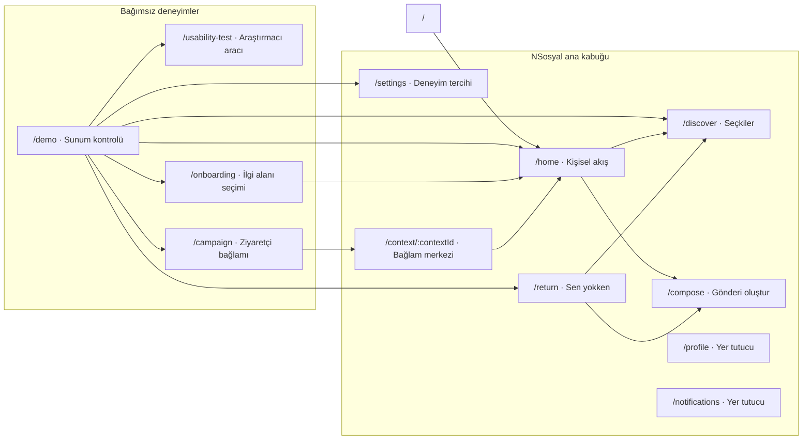
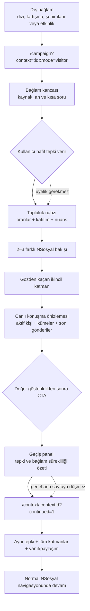
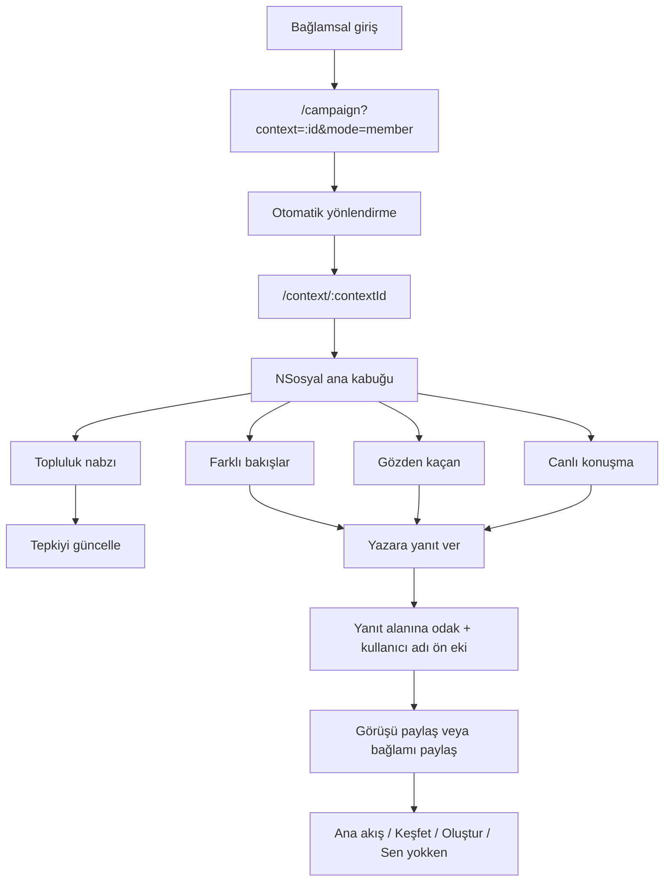
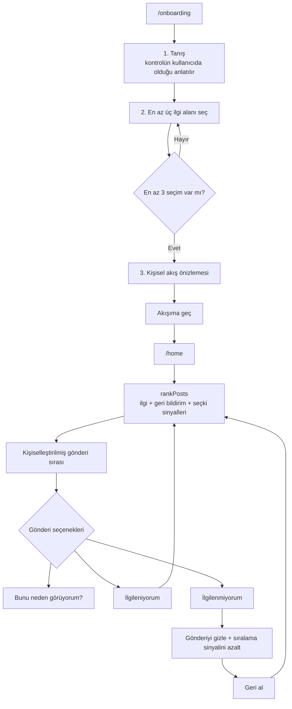
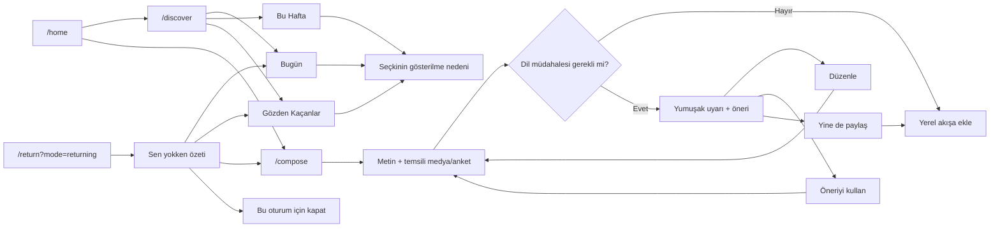
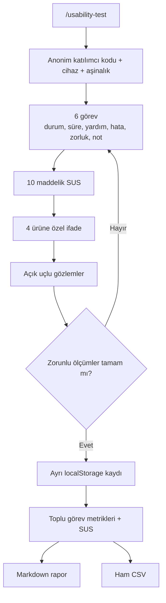

# NSosyal Kullanıcı Akışları, Arayüz ve Erişilebilirlik Raporu

**Tarih:** 24 Ağustos 2026

**İncelenen sürüm:** `dc53eaf` tabanlı yerel `main`

**Teknoloji:** Vue 3.5, Quasar 2.26, Pinia 3, Vue Router 5

**Kapsam:** Bağlamsal edinim, kişiselleştirme, ana akış, Keşfet, içerik oluşturma, geri dönüş, görünüm tercihleri ve kullanılabilirlik ölçüm aracı

## Yönetici özeti

NSosyal prototipi tek bir sosyal ürün kabuğu içinde iki ana giriş modelini birleştiriyor:

1. Dışarıdaki bir medya/şehir/etkinlik bağlamından gelen ziyaretçiye üyelik istemeden sosyal değer gösteren bağlamsal edinim akışı.
2. İlgi alanları, açık öneri kontrolleri, seçkiler, paylaşım ve geri dönüş özetiyle devam eden üye deneyimi.

Akışların temel tasarım ilkesi, kullanıcıdan büyük bir taahhüt istemeden önce anlamlı bir sosyal karşılık göstermektir. Ziyaretçi akışında tepki → topluluk nabzı → farklı bakışlar → gözden kaçan ayrıntı → canlı konuşma sırası kullanılır; dönüşüm çağrısı ancak bu değerden sonra gösterilir.

24 Ağustos 2026 tarihinde gerçekleştirilen tek kişilik iç uzman değerlendirmesinde altı görevin tamamı yardımsız ve hatasız tamamlandı. Tam görev başarısı `%100`, ortalama görev süresi `10,7 saniye`, ortalama algılanan zorluk `1,3/5`, öz-değerlendirme SUS puanı `90/100` oldu. Bu sonuçlar yalnızca uygulamanın iç kontrolü ve sonraki araştırmaya hazırlık içindir; bağımsız kullanıcı araştırması veya genellenebilir kullanılabilirlik kanıtı değildir.

En önemli takip noktaları:

- Açık temadaki marka mavisi ve üçüncül metin tokenları bazı küçük metin kullanımlarında WCAG AA kontrastını karşılamıyor.
- Tema kontrolü “Görünüm ve kullanım” sayfasında değil profil menüsünde; ayar görevi iki yüzeye bölünüyor.
- Ana akışın özel tab yapısı ok tuşu davranışı ve `aria-controls`/`tabpanel` ilişkisi açısından tam WAI-ARIA Tabs kalıbını uygulamıyor.
- Tekrarlanan “Bu görüşe yanıt ver” erişilebilir adları, kontrol listesinde hangi yazara yanıt verildiğini yeterince ayırt etmiyor.
- Gerçek karar için 5–7 harici katılımcıyla moderatörlü test ve ekran okuyucu doğrulaması hâlâ gerekli.

## 1. Bilgi mimarisi

Ana uygulama kabuğu geniş ekranda sol navigasyon + içerik sütunu + sağ bağlam rayı olarak çalışır. `959px` altında sol ve sağ raylar kalkar; üst uygulama çubuğu ile beş öğeli alt navigasyon devreye girer. Kampanya ziyaretçi akışı, kayıt öncesi odaklı ayrı `CampaignLayout` içinde kalır; dönüşümden sonra aynı bağlam ana NSosyal kabuğunda açılır.

## 2. Kullanıcı akışları

### 2.1 Ziyaretçi bağlamsal edinim akışı

Karar noktası: Kullanıcı tepki vermeden topluluk dağılımı görünmez. Bu tercih, salt gözlem yerine düşük maliyetli katılım üretir ve kullanıcının kendi görüşünü çoğunluğa göre sonradan şekillendirmesini azaltır.

### 2.2 Mevcut üyenin bağlama doğrudan girişi

Üye yolu ziyaretçi dönüşüm ekranını tekrar etmez. Sosyal katmanların tamamı doğrudan görünür; kullanıcı yeni bir kod taramadan normal NSosyal kullanımına devam eder.

### 2.3 İlgi alanı ve kişisel akış kontrolü

Kişiselleştirme kapalı kutu değildir. “Bunu neden görüyorum?”, “İlgileniyorum”, “İlgilenmiyorum” ve “Geri al” kontrolleri kullanıcının akış üzerinde görünür bir neden-sonuç ilişkisi kurmasını amaçlar.

### 2.4 Keşfet, paylaşım ve geri dönüş döngüsü

Bu döngüde Keşfet salt popülerlik listesi değildir; günlük, haftalık ve daha az görünmüş içerikleri ayrı niyetlerle sunar. Geri dönüş ekranı kullanıcıyı baskı oluşturan seri/ödül mekanikleriyle değil, kısa ve kapatılabilir bir özetle karşılar.

### 2.5 Araştırmacı ve sonuç akışı

Araştırma kayıtları `nsosyal.usability-results.v1` anahtarında tutulur ve kişiselleştirme/akış tercihleriyle karıştırılmaz.

## 3. Arayüz tasarım kararları

| Karar | Gerekçe | Uygulamadaki karşılığı | Kullanıcı etkisi |
| --- | --- | --- | --- |
| Bağlamı dönüşümden önce göstermek | Üye olmayan kişiye önce NSosyal’in sosyal değerini kanıtlamak | Tepki, nabız, perspektif, gözden kaçan ve canlı katmanlarından sonra CTA | Kayıt baskısı azalır; dönüşümün nedeni anlaşılır |
| Kademeli açılım | Uzun tek sayfada bilişsel yükü azaltmak, merakı sürdürmek | Her sosyal katmanda tek bir sonraki eylem | Kullanıcı sıradaki adımı kaybetmeden derinleşir |
| Bağlam sürekliliği | Dönüşüm sonrası genel akışa düşmenin yarattığı kopuşu önlemek | Tepki ve bağlam özeti; `continued=1` durumu; süreklilik bildirimi | Kullanıcının başlattığı niyet korunur |
| Veri güdümlü kampanya modeli | Aynı UX yapısını farklı dış anlarda tekrar kullanmak | `campaign-contexts.js` içinde dizi, tartışma, şehir ve teknoloji bağlamları | Demo çeşitlenir; sayfa kopyaları ve tutarsızlık azalır |
| Sosyal medya görsel dili | Deneyimin oyun/quiz gibi algılanmasını önlemek | Gönderi kartları, avatarlar, oranlar, canlı konuşma kümeleri | Bağlam katmanı NSosyal’in doğal bir parçası gibi görünür |
| Açık kişiselleştirme kontrolü | Öneri sistemini kullanıcıya açıklamak | İlgi seçimi, “Bunu neden görüyorum?”, olumlu/olumsuz geri bildirim, geri alma | Güven ve kontrol duygusu artar |
| Ayrı masaüstü ve mobil kabuk | Masaüstünde içerik/bağlam yoğunluğu; mobilde başparmak erişimi | 3 sütunlu masaüstü, 959px altında üst bar + alt navigasyon | Bilgi yoğunluğu cihazla birlikte değişir |
| Token tabanlı tema | Karanlık/açık mod ve bileşen tutarlılığını merkezi yönetmek | `--ns-*`, radius, boşluk, hareket ve dokunma tokenları | Tema değişimi bileşen bazında kopmaz |
| Deneyim ön ayarları | Yalnızca tema değil yoğunluk ve okunabilirliği de kullanıcıya bırakmak | Akışkan, Dengeli, Rahat | Farklı okuma ve tarama tercihleri desteklenir |
| Belirgin sistem durumları | Yükleme, hata, boş ve başarılı durumlarda belirsizliği azaltmak | Skeleton, `role="alert"`, durum bannerları, geri alma | Hatanın veri kaybı olmadığı ve sonraki eylem anlaşılır |
| Yerel ve seçici kalıcılık | Backend olmadan deterministik demo ve mahremiyet | İlgi, geri bildirim, tema, görünüm ve kampanya sürekliliği localStorage; geçici UI sınırlı | Demo yenilemede korunur; gereksiz veri saklanmaz |
| Azaltılmış hareket önceliği | Vestibüler hassasiyetleri ve işletim sistemi tercihini gözetmek | `prefers-reduced-motion` tüm geçişleri en aza indirir | Hareket seçeneği görünüm ön ayarının üstünde tutulur |

## 4. Erişilebilirlik yaklaşımı

### 4.1 Uygulanan yaklaşım

| Alan | Mevcut yaklaşım | Kod/arayüz kanıtı |
| --- | --- | --- |
| Sayfa yapısı | `header`, `main`, `nav`, `aside`, `section`, `article`, `footer` kullanımı | Ana kabuk, kampanya, Keşfet, gönderiler ve araştırmacı aracı |
| Başlık ilişkileri | Bölümler `aria-labelledby` ile görünür başlıklara bağlanıyor | Kampanya katmanları, ayarlar, reentry, test ekranı |
| Kontrol adları | Yalnız ikon kullanan düğmelerde `aria-label`; dekoratif ikonlarda `aria-hidden` | Tema, geri, sıfırla, paylaş, gönderi araçları |
| Durum bilgisi | `aria-pressed`, `aria-checked`, `aria-selected` ile seçim durumu | Tepki seçenekleri, ilgi alanları, beğeni/kaydetme, görünüm ön ayarları |
| Dinamik geri bildirim | `role="status"`, `aria-live="polite"`, hata için `role="alert"` | Akış güncelleme, seçim sayısı, kampanya dönüşümü, yayın ve hata durumları |
| Odak yönetimi | Müdahale sonrası taslağa; perspektif yanıtında textarea’ya; diyalog kapanınca seçenek düğmesine odak | Composer, bağlam merkezi, HomeFeedPost |
| Dokunma hedefi | Merkezi `--touch-target: 44px`; kritik kontrollerde en az 44px | Mobil navigasyon, kampanya başlığı, CTA ve test aracı |
| Renk dışı durum | Seçimlerde ikon, metin, yüzde ve `aria-*` birlikte kullanılıyor | Topluluk dağılımı ve seçili tepki yalnız renkle belirtilmiyor |
| Hareket | İşletim sistemi azaltılmış hareket tercihi tüm animasyonların önüne geçiyor | `app.scss` ve bileşen bazlı reduced-motion kuralları |
| Mobil uyum | 360px genişlikte kart/alanların tek sütuna düşmesi, safe-area alt boşlukları | Ana kabuk, kampanya, bağlam merkezi ve test aracı |
| Form desteği | Görünür etiketler, karakter sayacı, devre dışı durum ve hata metni | Composer, bağlam yanıtı, kullanılabilirlik formu |

### 4.2 Kontrast token incelemesi

Kontrast oranları WCAG bağıl parlaklık formülüyle token çiftlerinden hesaplandı:

| Kullanım | Renk çifti | Oran | Değerlendirme |
| --- | --- | ---: | --- |
| Açık tema ana metin | `#151923` / `#ffffff` | `17.57:1` | AA ve AAA normal metin geçer |
| Açık tema ikincil metin | `#5b6373` / `#ffffff` | `6.04:1` | AA normal metin geçer |
| Açık tema marka mavisi | `#1687f8` / `#ffffff` | `3.59:1` | Büyük metin/grafik için yeterli; küçük normal metinde AA değil |
| Açık tema üçüncül metin | `#9aa1ae` / `#ffffff` | `2.60:1` | Anlamlı küçük metin/placeholder için yetersiz |
| Karanlık tema ana metin | `#f7f8fb` / `#1c1f27` | `15.51:1` | AA ve AAA normal metin geçer |
| Karanlık tema ikincil metin | `#bbc1cd` / `#1c1f27` | `9.12:1` | AA ve AAA normal metin geçer |
| Karanlık tema marka mavisi | `#1687f8` / `#1c1f27` | `4.59:1` | AA normal metin geçer |

Marka mavisi açık temada küçük eyebrow/bağlantı metni veya beyaz düğme etiketiyle kullanıldığında kontrol edilmelidir. Açık tema için daha koyu bir etkileşim tokenı (örneğin en az `4.5:1` sağlayan bir ton) ve anlamlı üçüncül metin için daha koyu değer önerilir.

### 4.3 Erişilebilirlik bulguları ve açıklar

| Kimlik | Öncelik | Bulgu | Etki | Öneri |
| --- | --- | --- | --- | --- |
| A11Y-01 | Yüksek | Açık temada `--ns-brand` beyaz üzerinde `3.59:1`; `--ns-text-tertiary` `2.60:1` | Küçük metin, placeholder ve beyaz marka düğmesi etiketleri düşük kontrastlı olabilir | Açık tema etkileşim/üçüncül metin tokenlarını AA seviyesine koyulaştır; tüm kullanım noktalarını tekrar ölç |
| A11Y-02 | Orta | Ana akıştaki özel `tablist`, ok tuşu dolaşımı ve `aria-controls`/`tabpanel` ilişkisini uygulamıyor | Klavye ve ekran okuyucu kullanıcısı standart sekme davranışını bekleyebilir | QTabs kullan veya roving tabindex + ok/Home/End tuşları + ilişkili tabpanel ekle |
| A11Y-03 | Orta | Perspektif kartlarının yanıt düğmeleri aynı “Bu görüşe yanıt ver” adına sahip | Kontrol listesinde bağlamdan kopuk dolaşan ekran okuyucu kullanıcısı yazarı ayırt edemez | `:aria-label="`${perspective.author} görüşüne yanıt ver`"` kullan |
| A11Y-04 | Düşük | Onboarding ilerleme göstergesi aktif adımı yalnız görsel sınıfla anlatıyor | Ekran okuyucu mevcut adımı 1/3 metninden çıkarabilir ama ilerleme öğesinde doğrudan durum yok | Güncel öğeye `aria-current="step"`, tamamlananlara erişilebilir durum metni ekle |
| A11Y-05 | Düşük | Mobilde profil menüsündeki tema satırı, görünen metin ve switch etiketi nedeniyle erişilebilir ağaçta tekrarlı “Karanlık mod” ifadesi üretebiliyor | Gereksiz tekrar ve kontrol sınırı belirsizliği | Satırı tek bir switch etiketiyle sadeleştir; tıklanabilir label davranışını ekran okuyucuyla doğrula |
| A11Y-06 | Doğrulama açığı | Otomatik axe/Lighthouse ve gerçek ekran okuyucu turu henüz yok | Semantik olarak görünmeyen odak sırası, isim/rol/değer ve kontrast hataları kaçabilir | NVDA + Chrome ve VoiceOver + Safari turu; axe-core otomasyonu; %200/%400 zoom testi ekle |

## 5. İç kullanılabilirlik değerlendirmesi

### 5.1 Yöntem ve sınırlar

- **Oturum kodu:** `ID-01`
- **Tarih:** 24 Ağustos 2026
- **Değerlendirici:** Ürüne ve kaynak koda aşina iç uzman
- **Cihaz simülasyonu:** `360×800`, telefon
- **Yöntem:** `/usability-test` içindeki altı görevin görünür kontrollerle uçtan uca yürütülmesi
- **Kayıt:** Sonuç, süre, yardım, hata, zorluk, gözlem; ardından 10 maddelik SUS ve dört ürüne özel ifade
- **Teknik doğrulama:** Dokuz temel rotada yatay taşma kontrolü ve oturum boyunca konsol hata/uyarı kontrolü

Bu oturumda değerlendirici uygulamanın mimarisini bildiği için öğrenilebilirlik ve bulunabilirlik sonuçları gerçek ilk-kullanıcıdan daha iyi çıkabilir. Öz-değerlendirme SUS puanı yalnızca formülün ve raporlama aracının çalıştığını gösteren bir iç kıyas değeridir; bağımsız kullanıcıların SUS ortalaması olarak raporlanmamalıdır.

### 5.2 Nicel sonuçlar

| Görev | Sonuç | Süre | Yardım | Hata | Zorluk | Kısa gözlem |
| --- | --- | ---: | ---: | ---: | ---: | --- |
| Konuşmanın katmanlarını keşfet | Başarılı | 13 sn | 0 | 0 | 1/5 | Tepki sonrası nabız görünür oldu; katmanlar tek birincil eylemle sıralı açıldı |
| Aynı konuşmada devam et | Başarılı | 12 sn | 0 | 0 | 1/5 | Canlı önizleme, geçiş paneli ve süreklilik bildirimi aynı bağlamı doğruladı |
| Üye olarak bağlama gir | Başarılı | 9 sn | 0 | 0 | 1/5 | Doğrudan doğru bağlam merkezi açıldı; yanıt eylemi textarea’ya odak taşıdı |
| Akışını kontrol et | Başarılı | 12 sn | 0 | 0 | 2/5 | Kontrol taşma menüsündeydi; sonuç bannerı ve geri alma açık biçimde çalıştı |
| Gözden kaçanı bul | Başarılı | 4 sn | 0 | 0 | 1/5 | Sekme adı ve içerik üstündeki gösterim nedenleri hızlı anlaşıldı |
| Görünümü kendine göre ayarla | Başarılı | 14 sn | 0 | 0 | 2/5 | Rahat görünüm doğrudan bulundu; tema için profil menüsüne geçmek gerekti |

Özet:

- **Tam görev başarısı:** `6/6`, `%100`
- **Kısmi/başarısız görev:** `0`
- **Toplam süre:** `64 saniye`
- **Ortalama görev süresi:** `10,7 saniye`
- **Toplam yardım/hata:** `0 / 0`
- **Ortalama zorluk:** `1,3/5`
- **SUS:** `90/100` — araç sınıflandırmasına göre “Çok güçlü kullanılabilirlik”

SUS yanıtları: `4, 2, 5, 1, 4, 1, 5, 1, 5, 2`.

### 5.3 Ürüne özel değerlendirme

| İfade | Puan |
| --- | ---: |
| Açılan konuşmanın izlenen içerikle ilişkisi hemen anlaşıldı | 5/5 |
| Üye olmadan önce NSosyal’in sosyal değeri görülebildi | 5/5 |
| NSosyal’de devam edildiğinde aynı konuşma korundu | 5/5 |
| Bu konuşmaya NSosyal üzerinden katılma isteği | 4/5 |

Ortalama ürün puanı: `4,75/5`.

### 5.4 Nitel sonuçlar

**En kolay bulunan nokta:** Gözden Kaçanlar sekmesi ve seçkilerin neden gösterildiğini açıklayan etiketler.

**Karıştıran/yavaşlatan nokta:** Karanlık mod ayarının görünüm sayfasında değil profil menüsünde bulunması görev bağlamını iki yüzeye böldü.

**En önemli iyileştirme önerisi:** Tema kontrolünü “Görünüm ve kullanım” sayfasına da ekleyerek ayarların bulunabilirliğini artırmak.

**İç değerlendirici ifadesi:** “Bağlamdan topluluk nabzına geçiş adım adım ilerlediği için nerede olduğumu kaybetmedim.”

### 5.5 Teknik kontrol sonuçları

`360px` görünümde aşağıdaki rotaların hiçbirinde belge seviyesinde yatay taşma oluşmadı:

| Rota | Yatay taşma |
| --- | --- |
| `/campaign?context=series&mode=visitor` | Yok |
| `/context/series` | Yok |
| `/home` | Yok |
| `/discover?tab=overlooked` | Yok |
| `/settings` | Yok |
| `/compose` | Yok |
| `/return?mode=returning` | Yok |
| `/onboarding` | Yok |
| `/usability-test` | Yok |

Oturum boyunca tarayıcı konsolunda hata veya uyarı kaydedilmedi. Açık/karanlık tema ve Rahat/Dengeli görünüm geçişleri görünür durum metinleriyle doğrulandı. Test sonrası ürün tercihleri başlangıçtaki açık tema + Dengeli görünüm + nötr akış geri bildirimi durumuna getirildi; `ID-01` araştırma kaydı korundu.

## 6. Önceliklendirilmiş öneriler

1. **Kontrast tokenlarını düzelt:** Açık tema marka/üçüncül metin renklerini AA normal metin seviyesine getir; beyaz metinli birincil düğmeleri tekrar ölç.
2. **Ayar bilgi mimarisini birleştir:** Tema anahtarını profil menüsünde tutarken “Görünüm ve kullanım” sayfasına da ekle.
3. **Sekme klavye kalıbını tamamla:** Ana akış Akış/Medya sekmelerine standart ok tuşu ve tabpanel ilişkilerini uygula.
4. **Erişilebilir adları bağlama özgü yap:** Perspektif yanıtı ve benzeri tekrarlanan kontrollerde yazar/öğe adını etikete dahil et.
5. **Harici test yürüt:** Çoğunluğu NSosyal’i ilk kez gören 5–7 kişiyle aynı görevleri uygula; en az beş telefon ve bir masaüstü oturumu topla.
6. **Yardımcı teknoloji turu ekle:** NVDA/Chrome, VoiceOver/Safari, %200 ve %400 zoom, axe-core ve yalnız klavye senaryolarını QA matrisine ekle.
7. **İkinci test turunda kritik metriği izle:** Özellikle “Akışını kontrol et” ve “Görünümü kendine göre ayarla” görevlerinde bulunabilirlik, süre ve yardım sayısını karşılaştır.

## 7. Kanıt ve dosyalar

- Test protokolü: [`USABILITY_TEST.md`](./USABILITY_TEST.md)
- Ham iç değerlendirme verisi: [`usability-results/2026-08-24-internal-expert-walkthrough.csv`](./usability-results/2026-08-24-internal-expert-walkthrough.csv)
- Test görevleri ve hesaplama modeli: `src/data/usability-test.js`
- Araştırmacı arayüzü: `src/pages/UsabilityTestPage.vue`
- Route haritası: `src/router/routes.js`
- Tasarım tokenları: `src/css/app.scss`

## Sonuç

Prototipin temel akışları birbirinden kopuk demo sayfaları yerine aynı durum modeli ve NSosyal görsel dili etrafında birleşiyor. İç değerlendirme, bağlamsal edinim akışındaki değer sıralamasının ve aynı konuşmada devam ilkesinin işlediğini doğruladı. Buna karşın erişilebilirlik açısından açık tema kontrastı, standart sekme klavye davranışı ve bazı kontrol adları çözülmeden tam uygunluk iddia edilmemelidir. Bir sonraki güvenilir karar noktası, bu rapordaki aynı görevlerle yürütülecek harici kullanıcı testi ve yardımcı teknoloji doğrulamasıdır.
